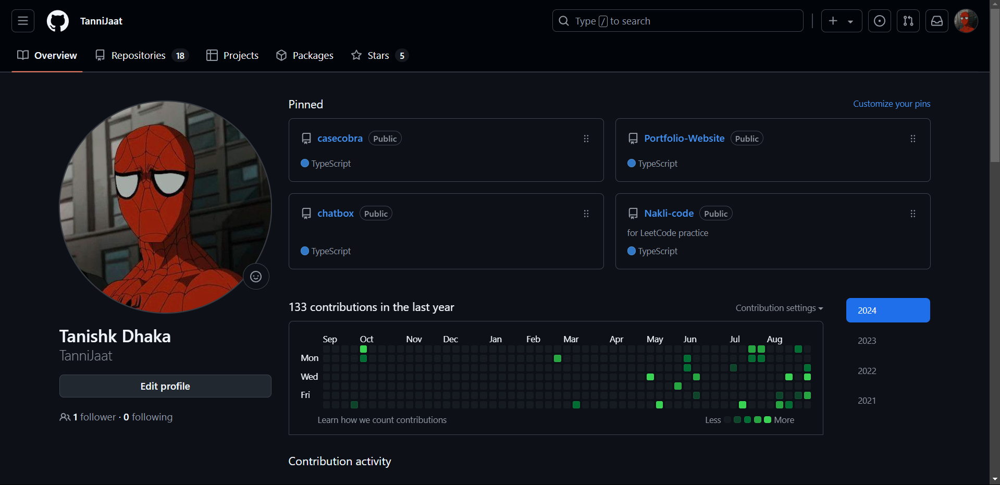

# Hi there 👋, I'm Tanishk Dhaka!

Welcome to my temporary GitHub portfolio. While my main account is currently flagged, I've created this account to showcase some of my top projects. These repositories reflect my expertise in 
web development, full-stack engineering, and problem-solving.

### 🔒 Proof of Flagged Account

Here's a screenshot showing that my main GitHub account is currently flagged:

### 🚀 Featured Projects

#### 1. **Portfolio Website**
- **Description:**  
  This is my personal portfolio website, designed to showcase my skills, projects, and professional experience. The website is fully responsive, with a clean and modern design, ensuring a seamless user experience across all devices.
- **Tech Stack:**  
  Next.js, React, Tailwind CSS, TypeScript
- **Key Contributions:**  
  - Designed the website with a minimalist approach, ensuring a clean and modern user interface that effectively highlights projects without unnecessary distractions.
  - Ensured full responsiveness, providing a seamless experience across all devices, including mobile phones, tablets, and desktops.

#### 2. **Chat Group/Forum**
- **Description:**  
  A user-friendly chat group or forum where users can join by simply entering a name—no login required. This project facilitates easy and quick communication, ideal for casual discussions or community interactions.
- **Tech Stack:**  
  Next.js, React, Supabase, Uploadthing
- **Key Contributions:**  
  - Enabled a seamless entry process by allowing users to join the chat by just providing a name, reducing barriers to participation.
  - Integrated **Uploadthing** to handle file uploads, allowing users to easily upload and store images within the chat. This integration simplifies the process of managing media content and ensures smooth handling of file uploads.
  - Utilized **Supabase** for the backend, managing real-time communication, user data, and storage efficiently, providing a robust and scalable solution.

#### 3. **DSA Preparation Sheet**
- **Description:**  
  A comprehensive preparation sheet for data structures and algorithms (DSA), curated from various sources to assist in DSA preparation. The project allows users to filter questions based on difficulty, company, and tags, and includes a search feature to easily find specific questions.
- **Tech Stack:**  
  TypeScript, React
- **Key Contributions:**  
  - Curated and organized DSA question data from various sources, providing a centralized resource for practice and preparation.
  - Implemented filtering options based on difficulty, company, and tags, enabling users to focus on specific types of questions.
  - Added a search feature to facilitate quick access to particular questions or topics.
  - Designed an intuitive and user-friendly interface, ensuring a smooth and effective user experience.
  - Did not prioritize mobile responsiveness, as the primary use case is for desktop-based LeetCode preparation, given the nature of the tool and user behavior.

#### 4. **Case Cobra**
- **Description:**  
  An e-commerce site allowing users to customize their phone cases with personal images and other specifications. This project was developed as a practice project based on a YouTube tutorial and showcases functionalities for product customization and online transactions.
- **Tech Stack:**  
  Next.js, Neon DB, Stripe
- **Key Contributions:**  
  - Implemented a drag-and-drop upload feature to let users easily add their images for custom phone case designs.
  - Integrated Stripe for secure and efficient payment processing, providing a seamless checkout experience.
  - Developed a user-friendly interface that allows users to select and customize phone case specifications.
  - Utilized Neon DB for database management, ensuring efficient handling of user and product data.
  - Followed a YouTube tutorial for guidance and best practices, gaining practical experience in e-commerce development.

### 💡 Why This Account?

This is a temporary account I've set up while my main GitHub account is flagged. I wanted to ensure that my top projects remain accessible, showcasing my work during this period. Please feel free to explore these repositories and get a sense of my skills and experience.

Thank you for visiting!
